# Python Online Editor Sign Up
We will be using the online IDE [cloud9](https://c9.io) to write python code this semester.  Below are instructions for how to sign up, name a file, create a new file, and turn in a file. Refer back to this sheet if you are having difficulties. 

## Sign Up Instructions

1. Open up your email and find an email from Cloud 9 to sign up
2. Click the sign up button. 
3. Enter your Name in the box provided
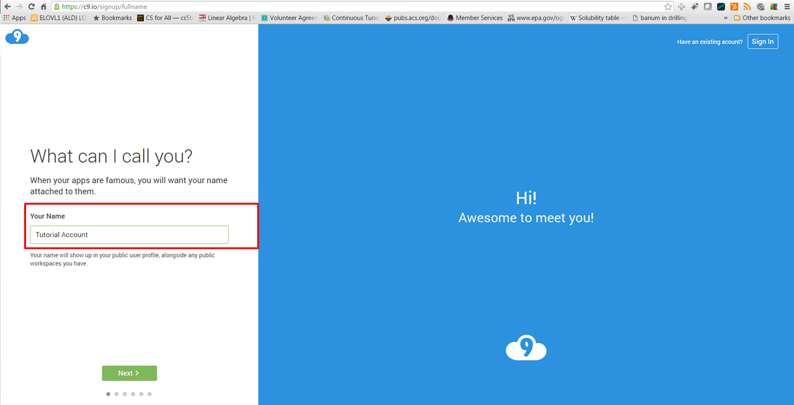

4. Create a username FirstnameLastName (All in lowercase)
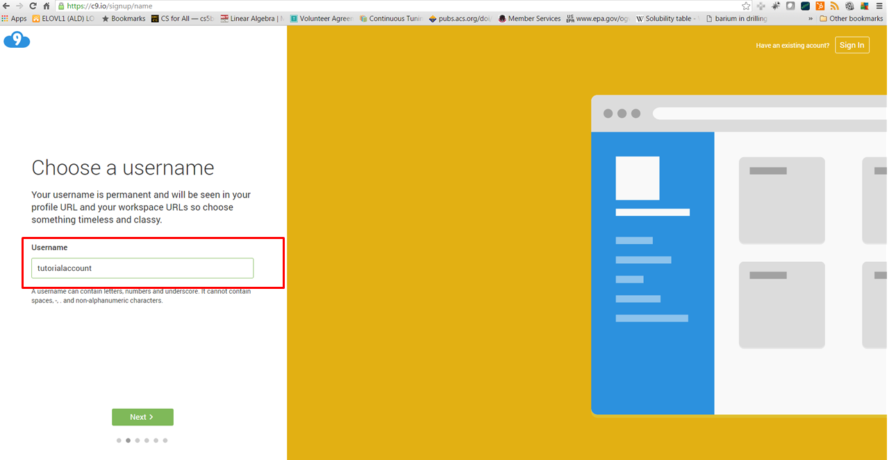

5. Select that you are a Student Developer
6. Select that you will use Cloud9 for Course work
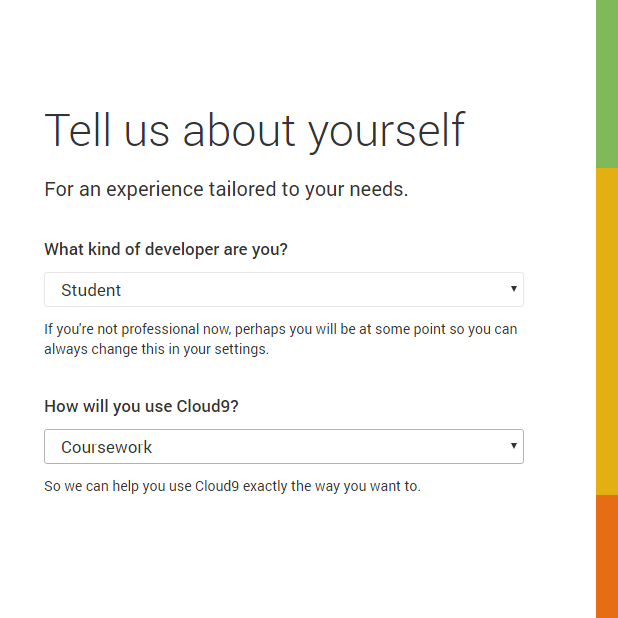

7. Confirm account details on the next page (Just click next)
8. Confirm that you are not a robot
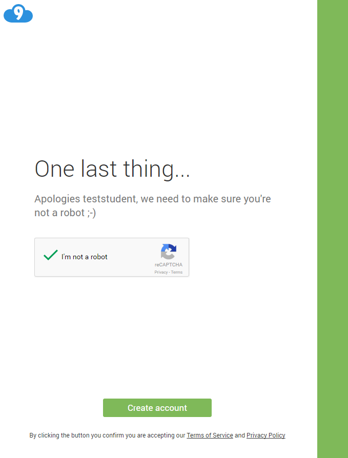

9. Student should have access to shared team workspace: 
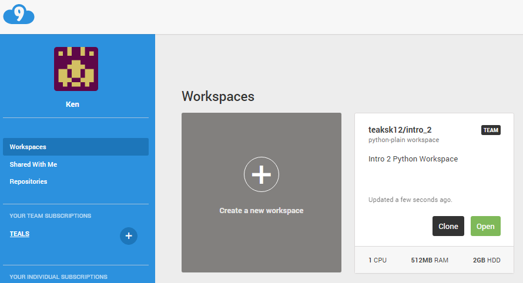

10. Click the plus sign to Create a new workspace
11. In “Workspace name” field enter “mypythonworkspace”
12. Give it a description of “This is my example workspace”
13. Make your workspace private
14. Select “Python” Template button  
15. Click "Create workspace" at the bottom of the page
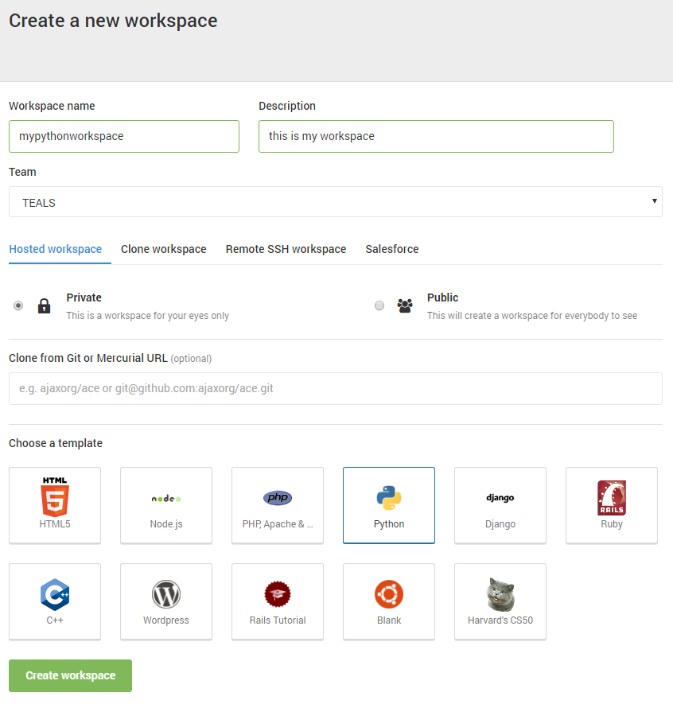

16. This will take a few seconds to set you up, but it will look like this: 
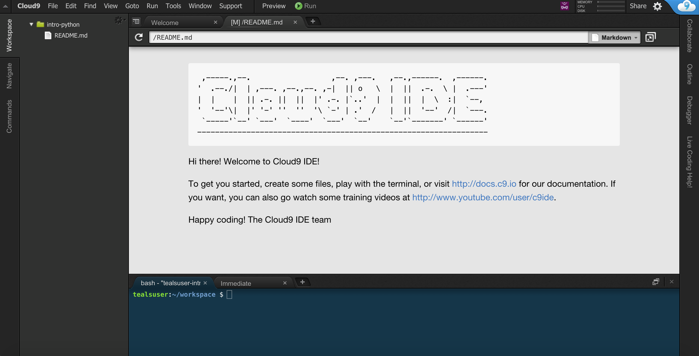

17. From the top panel select window, pick share (third choice from the top)
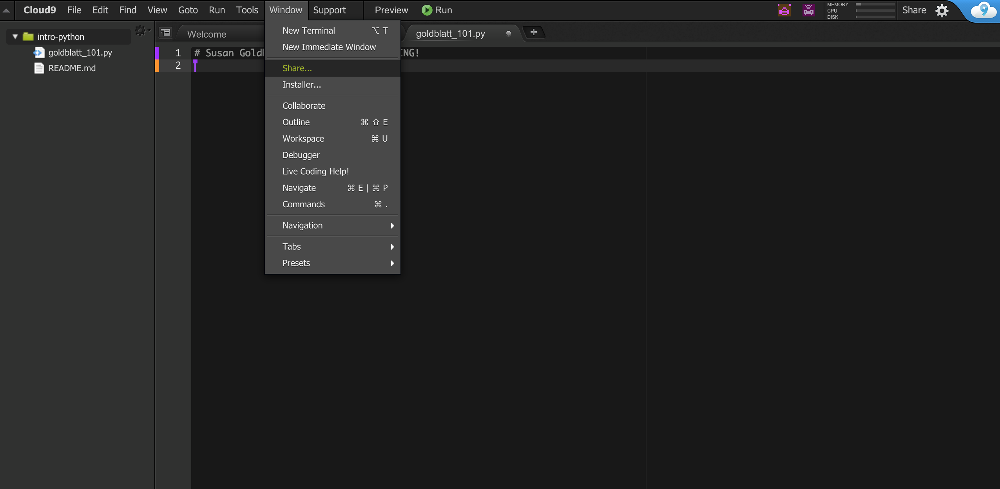

18. Enter your teachers' username or email in the "Invite People" section - this shares your workspace with your teachers and allows them to add comments. 
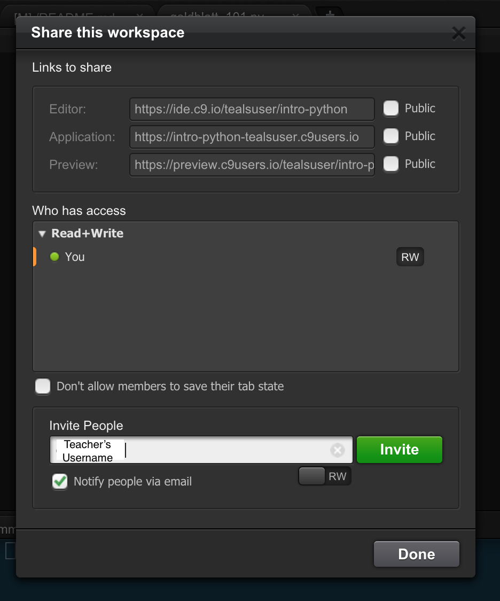

## Creating a New File
1. Click the plus button near the top of the page to create a new file 
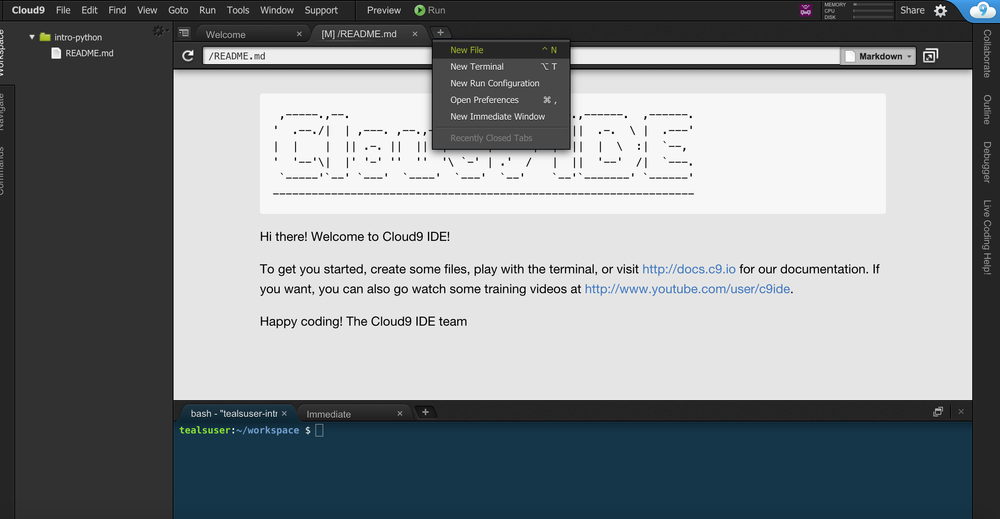
2. Press Ctrl-s to save the file. Enter the filename(following your classes conventions) and press the save button

## Parts of the IDE
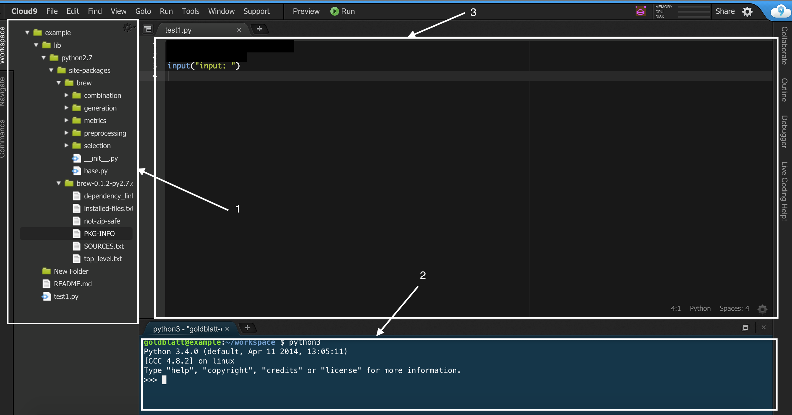
1. *File tree*
2. *Bash/terminal*
3. *Editor*

You can ignore the other parts for now!

## Running Python3 via Run Button Set Up
Cloud9 Python defaults to Python 2.7.6. It can be changed to use Python 3.4.3 by doing the following:

1. Right mouse click on the Run button at the top of the Cloud9 Python window
2. Select Manage... from the pull down that appears
3. On the Project Settings window that appears, scroll down to Language Support
4. On the scroll list that appears to the right of the heading Python Version:, select the Python 3 entry
5. Exit the Preferences Tab on the line right below top line starting with Cloud9 and containing the Run button.

## Running Python 
1. In the bottom half of the screen there should be a tab called "bash"
	1. If there is not a tab called "bash", click the plus button and choose "new terminal"
	
2. To run the interactive shell: type `python3` into the prompt
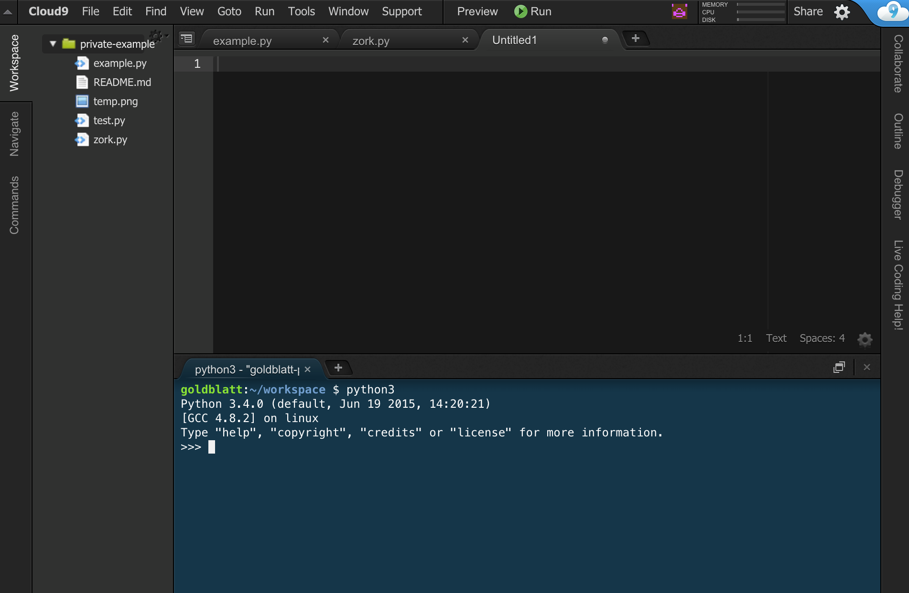 
3. To run a file: type `python3 [filename]`, but instead of `[filename]` use the name of the file you are trying to run

